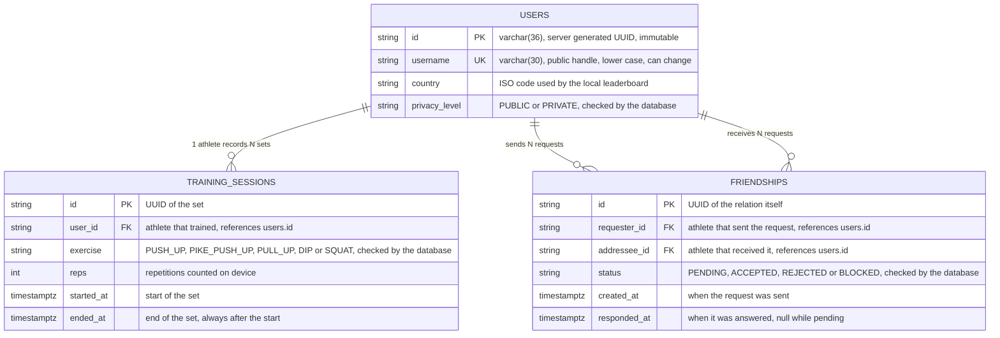

# Tatakae API


Friendship, training session and leaderboard microservice for **Tatakae**, an iOS calisthenics app that counts repetitions on device with AI.

> **Academic project.** Built for the **Talento Ready** program by **Desafío Latam** and **Globant**. Milestone 1 produced the pure domain core, Milestone 3 restructured it into layered Clean Architecture with tactical DDD, and **Milestone 4 (this delivery)** turned it into a persistent, documented Spring Boot microservice. It models what the social and leaderboard backend for Tatakae could look like; it is not the production backend of the published app.

The feature this milestone adds is the **friends CRUD**: the piece the app needs before global, local and friends leaderboards can exist.

## Identity and handle are two different things

An athlete has a **`userId`**, a server generated UUID, and a **`username`**, the public handle other people type. They are deliberately separate.

- The **identity never changes**. Friendships, training sessions and any future moderation record point at the UUID, so a rename can never orphan them or hand a report over to whoever grabs the freed handle.
- The **handle can change**, and it is unique at any point in time. `PUT /api/v1/users/{userId}` renames an athlete and answers 409 when another one already owns the target handle.
- Handle rules, in the spirit of an Instagram username: 1 to 30 characters, lower case letters, digits, dots and underscores. Stored normalized, so `Yeikobu` and `yeikobu` are the same handle and the second registration is rejected with 409.
- Two value objects guard this. `UserId` refuses anything that is not a UUID, so a malformed path is a clean 400 instead of a lookup miss. `Username` validates and normalizes the handle in its compact constructor, so an invalid handle cannot exist in memory.
- People type handles, not UUIDs, so `GET /api/v1/users?username=yeikobu` resolves a handle into the athlete that currently owns it.

## Tech stack

| Layer | Technology |
|---|---|
| Language | Java 21 (compiled with `release 21`, runs on JDK 25) |
| Framework | Spring Boot 3.5.16, Spring Web MVC, Spring Data JPA, Bean Validation |
| Database | PostgreSQL 16 running in Docker |
| Contracts | Springdoc OpenAPI 2.8.17, Swagger UI restricted to the `dev` profile |
| Testing | JUnit 5, Mockito, MockMvc slices, Testcontainers, JaCoCo |
| Build | Maven, wrapper included |

## Package map

```
fit.tatakae
├── TatakaeApiApplication.java
├── domain                    <-- Zero frameworks (pure Java)
│   ├── entity                  User, Friendship, FriendshipStatus, TrainingSession, Exercise, PrivacyLevel
│   ├── valueobject             UserId, Username, RepsCount, SessionTimeframe (records, self validating)
│   ├── exception               InvalidUserException, DuplicateUserException, InvalidFriendshipException,
│   │                           SelfFriendshipException, DuplicateFriendshipException,
│   │                           InvalidFriendshipTransitionException, InconsistentSessionException,
│   │                           FraudulentSessionException, ResourceNotFoundException
│   ├── repository              UserRepository, FriendshipRepository, SessionRepository (pure contracts)
│   └── service                 FriendshipService, LeaderboardService (domain services)
├── application               <-- Use cases, orchestrate the domain
│   └── usecase                 RegisterUser, GetUser, ListUsers, UpdateUser, DeleteUser,
│                               FindUserByUsername, SendFriendRequest, RespondFriendRequest, GetFriendship,
│                               ListFriends, ListFriendRequests, RemoveFriendship,
│                               RecordTrainingSession, GetLeaderboard
└── infrastructure            <-- Adapters, technology specific
    ├── persistence
    │   ├── entity              UserEntity, FriendshipEntity, TrainingSessionEntity (@Entity, @Table, @Id)
    │   ├── repository          UserJpaRepository, FriendshipJpaRepository, TrainingSessionJpaRepository
    │   ├── mapper              UserMapper, FriendshipMapper, TrainingSessionMapper
    │   └── adapter             JpaUserRepository, JpaFriendshipRepository, JpaSessionRepository
    └── web
        ├── config              BeanConfiguration, OpenApiConfig (@Profile("dev"))
        ├── controller          UserController, FriendshipController, TrainingSessionController,
        │                       LeaderboardController
        ├── dto                 Request and response records annotated with @Schema, ErrorResponse
        └── exception           GlobalExceptionHandler (@RestControllerAdvice)
```

## Architecture highlights

- **Dependency rule.** `domain` and `application` import no framework, no database and no `infrastructure` class. JPA annotations live exclusively in `infrastructure.persistence.entity`, never on a domain entity.
- **Ports and adapters.** `UserRepository`, `FriendshipRepository` and `SessionRepository` are pure interfaces in the domain. Their only implementations are the `Jpa*` adapters, so swapping storage never touches business code.
- **Spring stays outside.** Use cases and domain services are plain objects wired by hand in `BeanConfiguration`. There is not a single Spring annotation inside the business core.
- **Identity is a value object.** `UserId` and `Username` validate in their compact constructors, so neither a malformed UUID nor an invalid handle can exist in memory. Both ends of `Friendship` are built through `UserId`, which is why a self friend request is caught even when the UUID casing differs.
- **Behavior rich entities.** `Friendship` owns its own state machine: only a `PENDING` request can be accepted or rejected, a user cannot befriend itself, and blocking is the only transition allowed on an already accepted relation.
- **Friendship uniqueness is a domain rule, not a database constraint.** A rejected relation may be requested again, so `FriendshipService` consults the newest relation between both users through `findBetween` instead of relying on a unique index that would forbid the retry.
- **Deleting an athlete cascades from the use case, not from the schema.** `DeleteUserUseCase` clears the training sessions and the friendships before removing the athlete. The rule lives in the application layer where it can be read and tested, instead of hiding in an `ON DELETE CASCADE` that only the database knows about.
- **Privacy is scope aware.** Global and local rankings only show public athletes. The friends ranking shows the whole circle, private profiles included, because that is the audience the athlete opted into.

## Relational database model and table references

Two relationships shape the schema. **One athlete records N training sessions (1:N)**, and
**athletes relate to each other through friendships**, a self referencing N:N where every row
also carries the state of the request. Identities are UUIDs stored as `varchar(36)`, and the
handle lives in its own unique column so it can change without touching anything that points
at the athlete.



### Table references and foreign keys

The three enum columns are guarded by `CHECK` constraints that Hibernate derives from the Java
enums, so an invalid `status`, `privacy_level` or `exercise` cannot reach the table even through
raw SQL.

Referential integrity is enforced in two different places, on purpose:

1. `training_sessions.user_id` to `users.id` is a **real foreign key**. The JPA entity maps the
   athlete as `@ManyToOne` with `@JoinColumn(name = "user_id", nullable = false)`, so the database
   itself refuses an orphan session. This is what makes `DeleteUserUseCase` clear the sessions
   before removing the athlete.
2. `friendships.requester_id` and `friendships.addressee_id` hold `users.id` values but carry
   **no database level foreign key**. Both ends are stored as plain identifiers rather than
   `@ManyToOne` associations, because the domain models a friendship as a relation between two
   identities, not as an object graph to be traversed. Existence is checked by
   `SendFriendRequestUseCase` before the row is written, and both columns are indexed
   (`idx_friendship_requester`, `idx_friendship_addressee`) so the lookups stay cheap.

That second decision is a trade off worth stating plainly: it keeps the aggregate boundaries clean
and the queries simple, at the cost of trusting the application layer for integrity that the
database could enforce on its own.

## Endpoints

Base path `/api/v1`.

| Verb | Route | Success | Purpose |
|---|---|---|---|
| GET | `/healthcheck` | 200 | Liveness probe, reports `DOWN` when the database is unreachable |
| POST | `/users` | 201 | Register an athlete |
| GET | `/users` | 200 | List athletes, or resolve one handle with `?username=yeikobu` |
| GET | `/users/{userId}` | 200 | Get one athlete |
| PUT | `/users/{userId}` | 200 | Update the profile, handle included |
| DELETE | `/users/{userId}` | 204 | Delete an athlete, along with its sessions and friendships |
| POST | `/friendships` | 201 | Send a friend request, body `{"requesterId":"<uuid>","addresseeId":"<uuid>"}` |
| GET | `/friendships/{id}` | 200 | Get one friendship |
| PATCH | `/friendships/{id}` | 200 | Answer a request, body `{"status":"ACCEPTED"}` or `{"status":"REJECTED"}` |
| DELETE | `/friendships/{id}` | 204 | Remove a friendship or cancel a request |
| GET | `/users/{userId}/friends` | 200 | List accepted friends |
| GET | `/users/{userId}/friend-requests?direction=incoming\|outgoing` | 200 | List pending requests |
| POST | `/training-sessions` | 201 | Record a counted set |
| GET | `/leaderboards/{exercise}?scope=GLOBAL\|COUNTRY\|FRIENDS&country=&userId=` | 200 | Ranking for one exercise |

`/healthcheck` is the only management endpoint mapped over HTTP, and it sits outside `/api/v1`
because it describes the service, not the domain. It is Spring Boot Actuator underneath, so it
actually opens a connection to PostgreSQL instead of answering a hardcoded `UP`: if the database
goes away the probe turns `DOWN` and answers 503, which is what makes it usable by a load balancer
or an uptime monitor. Component details are shown under `dev` and hidden everywhere else.

### Unified error contract

Every failure, validation or business rule alike, is intercepted by `GlobalExceptionHandler` and returned as the same JSON shape. No native server stack trace ever reaches the client.

```json
{
  "message": "User ghost was not found",
  "code": "RESOURCE_NOT_FOUND",
  "status": 404,
  "path": "/api/v1/users/ghost",
  "timestamp": "2026-08-28T04:10:22.481Z",
  "details": null
}
```

| Status | Code | Raised by |
|---|---|---|
| 400 | `VALIDATION_ERROR` | Bean Validation failures, with a field by field `details` list |
| 400 | `INVALID_REQUEST` | `InvalidUserException` (malformed UUID or handle), `InvalidFriendshipException`, `InconsistentSessionException`, unknown scope or direction, path variable of the wrong type |
| 400 | `MALFORMED_REQUEST` | Unparseable JSON body or unsupported enum value |
| 404 | `RESOURCE_NOT_FOUND` | `ResourceNotFoundException` |
| 404 | `ENDPOINT_NOT_FOUND` | A route that is not mapped, so an unknown URL never reaches the 500 handler |
| 405 | `METHOD_NOT_ALLOWED` | A verb the route does not support |
| 409 | `RESOURCE_ALREADY_EXISTS` | `DuplicateUserException` (handle taken, on register or rename), `DuplicateFriendshipException` |
| 422 | `BUSINESS_RULE_VIOLATION` | `SelfFriendshipException`, `InvalidFriendshipTransitionException`, `FraudulentSessionException` |
| 500 | `INTERNAL_ERROR` | Anything unexpected, sanitized before leaving the server |

## Running it

### 1. Start the database

```bash
docker compose up -d
```

`compose.yml` starts `postgres:16-alpine` as `tatakae-postgres-db` with a named volume, so data survives a container restart. Defaults: database `tatakae_db`, user `tatakae_user`, password `tatakae_pass`, port 5432. Override them with the `DB_NAME`, `DB_USER`, `DB_PASSWORD` and `DB_PORT` environment variables.

### 2. Run the application in development mode

```bash
./mvnw spring-boot:run
```

`application.yaml` declares `spring.profiles.default: dev`, so this lands on the development profile with the local database and the documentation switched on. Passing `-Dspring-boot.run.profiles=dev` is equivalent and only worth typing if you already have `SPRING_PROFILES_ACTIVE` set to something else in your shell.

### 3. Read and test the contract

- Swagger UI: http://localhost:8080/swagger-ui.html
- OpenAPI JSON: http://localhost:8080/api-docs

Both are reachable **only** under the `dev` profile. `application.yaml` ships with `springdoc.api-docs.enabled: false` and `springdoc.swagger-ui.enabled: false`, `application-prod.yaml` keeps them off explicitly, and `OpenApiConfig` is annotated `@Profile("dev")`, so a production deployment answers 404 on both routes and exposes no attack surface.

```bash
SPRING_PROFILES_ACTIVE=prod ./mvnw spring-boot:run
```

## Testing it with cURL

Every command below assumes the application is running on port 8080 under the `dev` profile, which is what `./mvnw spring-boot:run` gives you. Athlete identities are UUIDs minted by the server, so the walkthrough captures them into shell variables as it goes: paste the commands in order, in the same terminal, and each one feeds the next.

### The happy path

```bash
# 0. Is the service alive, database included?
curl -i -X GET http://localhost:8080/healthcheck
```

```bash
# 1. Register two athletes and keep their identities
USER_A=$(curl -s -X POST http://localhost:8080/api/v1/users \
  -H "Content-Type: application/json" \
  -d '{"username": "yeikobu", "country": "cl", "privacyLevel": "PUBLIC"}' \
  | python3 -c "import sys,json;print(json.load(sys.stdin)['userId'])")

USER_B=$(curl -s -X POST http://localhost:8080/api/v1/users \
  -H "Content-Type: application/json" \
  -d '{"username": "KENSHIN", "country": "cl", "privacyLevel": "PRIVATE"}' \
  | python3 -c "import sys,json;print(json.load(sys.stdin)['userId'])")

echo "yeikobu -> $USER_A"
echo "kenshin -> $USER_B"
```

The second handle was sent in upper case and comes back as `kenshin`: handles are normalized on the way in.

```bash
# 2. Resolve a public handle into the athlete that owns it
curl -i -X GET "http://localhost:8080/api/v1/users?username=YEIKOBU"
```

```bash
# 3. Send a friend request and keep the relation id
FRIENDSHIP=$(curl -s -X POST http://localhost:8080/api/v1/friendships \
  -H "Content-Type: application/json" \
  -d "{\"requesterId\": \"$USER_A\", \"addresseeId\": \"$USER_B\"}" \
  | python3 -c "import sys,json;print(json.load(sys.stdin)['id'])")

echo "friendship -> $FRIENDSHIP"
```

```bash
# 4. The request is waiting for kenshin
curl -i -X GET "http://localhost:8080/api/v1/users/$USER_B/friend-requests?direction=incoming"

# and yeikobu can see it is still unanswered
curl -i -X GET "http://localhost:8080/api/v1/users/$USER_A/friend-requests?direction=outgoing"
```

```bash
# 5. Accept it
curl -i -X PATCH "http://localhost:8080/api/v1/friendships/$FRIENDSHIP" \
  -H "Content-Type: application/json" \
  -d '{"status": "ACCEPTED"}'
```

```bash
# 6. They are friends now
curl -i -X GET "http://localhost:8080/api/v1/users/$USER_A/friends"
```

```bash
# 7. Record one counted set for each athlete
curl -s -X POST http://localhost:8080/api/v1/training-sessions \
  -H "Content-Type: application/json" \
  -d "{\"userId\": \"$USER_A\", \"exercise\": \"PULL_UP\", \"reps\": 20,
       \"start\": \"2026-08-28T10:00:00Z\", \"end\": \"2026-08-28T10:01:00Z\"}"

curl -s -X POST http://localhost:8080/api/v1/training-sessions \
  -H "Content-Type: application/json" \
  -d "{\"userId\": \"$USER_B\", \"exercise\": \"PULL_UP\", \"reps\": 30,
       \"start\": \"2026-08-28T10:00:00Z\", \"end\": \"2026-08-28T10:01:00Z\"}"
```

```bash
# 8. The three leaderboard scopes
curl -i -X GET "http://localhost:8080/api/v1/leaderboards/PULL_UP?scope=GLOBAL"
curl -i -X GET "http://localhost:8080/api/v1/leaderboards/PULL_UP?scope=COUNTRY&country=cl"
curl -i -X GET "http://localhost:8080/api/v1/leaderboards/PULL_UP?scope=FRIENDS&userId=$USER_A"
```

`kenshin` is `PRIVATE`, so the athlete shows up in the friends ranking and disappears from the global one. Privacy hides you from strangers, not from the circle you opted into.

### Renaming, the reason identities are UUIDs

```bash
# 9. kenshin becomes battousai
curl -i -X PUT "http://localhost:8080/api/v1/users/$USER_B" \
  -H "Content-Type: application/json" \
  -d '{"username": "battousai", "country": "jp", "privacyLevel": "PRIVATE"}'

# 10. The friendship and the ranking follow the athlete, not the old name
curl -i -X GET "http://localhost:8080/api/v1/users/$USER_A/friends"
curl -i -X GET "http://localhost:8080/api/v1/leaderboards/PULL_UP?scope=FRIENDS&userId=$USER_A"

# 11. And the handle it left behind is free again
curl -i -X POST http://localhost:8080/api/v1/users \
  -H "Content-Type: application/json" \
  -d '{"username": "kenshin", "country": "cl", "privacyLevel": "PUBLIC"}'
```

### Every error the API can answer

```bash
# 400 VALIDATION_ERROR, the handle breaks the format rules
curl -i -X POST http://localhost:8080/api/v1/users \
  -H "Content-Type: application/json" \
  -d '{"username": "jacob aguilar", "country": "cl", "privacyLevel": "PUBLIC"}'

# 400 INVALID_REQUEST, the identity in the path is not a UUID
curl -i -X GET http://localhost:8080/api/v1/users/yeikobu

# 400 MALFORMED_REQUEST, unsupported enum value in the body
curl -i -X POST http://localhost:8080/api/v1/users \
  -H "Content-Type: application/json" \
  -d '{"username": "someone", "country": "cl", "privacyLevel": "SECRET"}'

# 404 RESOURCE_NOT_FOUND, a well formed identity nobody owns
curl -i -X GET http://localhost:8080/api/v1/users/00000000-0000-0000-0000-000000000000

# 404 ENDPOINT_NOT_FOUND, an unmapped route never becomes a 500
curl -i -X GET http://localhost:8080/api/v1/nothing-here

# 405 METHOD_NOT_ALLOWED
curl -i -X PUT "http://localhost:8080/api/v1/friendships/$FRIENDSHIP" \
  -H "Content-Type: application/json" -d '{}'

# 409 RESOURCE_ALREADY_EXISTS, the handle is taken, casing included
curl -i -X POST http://localhost:8080/api/v1/users \
  -H "Content-Type: application/json" \
  -d '{"username": "YEIKOBU", "country": "cl", "privacyLevel": "PUBLIC"}'

# 422 BUSINESS_RULE_VIOLATION, an athlete cannot befriend itself
curl -i -X POST http://localhost:8080/api/v1/friendships \
  -H "Content-Type: application/json" \
  -d "{\"requesterId\": \"$USER_A\", \"addresseeId\": \"$USER_A\"}"

# 422 BUSINESS_RULE_VIOLATION, the request was already answered
curl -i -X PATCH "http://localhost:8080/api/v1/friendships/$FRIENDSHIP" \
  -H "Content-Type: application/json" \
  -d '{"status": "ACCEPTED"}'

# 422 BUSINESS_RULE_VIOLATION, more reps than a human can do in that minute
curl -i -X POST http://localhost:8080/api/v1/training-sessions \
  -H "Content-Type: application/json" \
  -d "{\"userId\": \"$USER_A\", \"exercise\": \"PULL_UP\", \"reps\": 400,
       \"start\": \"2026-08-28T10:00:00Z\", \"end\": \"2026-08-28T10:01:00Z\"}"
```

Every one of them answers the same `ErrorResponse` shape. None of them returns a server stack trace.

### Cleaning up

```bash
# Deleting an athlete also clears its sessions and friendships
curl -i -X DELETE "http://localhost:8080/api/v1/users/$USER_A"
curl -i -X DELETE "http://localhost:8080/api/v1/users/$USER_B"

# The rankings are empty again
curl -i -X GET "http://localhost:8080/api/v1/leaderboards/PULL_UP?scope=GLOBAL"
```

To start over from an empty database, `docker compose down -v` drops the volume and `docker compose up -d` recreates it.

## Test suite

```bash
./mvnw clean verify
```

Docker must be running: the persistence adapters are tested against a real PostgreSQL 16 container through Testcontainers, never an embedded database.

The suite covers every layer:

- **Domain and application**: JUnit 5 with strict Arrange, Act, Assert phases, business exceptions verified with `assertThrows`, collaborators stubbed with Mockito, parameterized tests for null and empty inputs.
- **Persistence**: mapper round trips plus adapter tests against PostgreSQL in Docker.
- **Web**: `@WebMvcTest` slices per controller, including one assertion per branch of the global error handler.
- **Wiring and profiles**: the full application context boots against PostgreSQL, and two tests prove Swagger answers 200 under `dev` and 404 under `prod`.

`jacoco:check` fails the build below 100% line and branch coverage. The bootstrap class, the Spring configuration classes, the request and response records and the JPA entities are excluded, since they hold no logic.

Coverage report: `target/site/jacoco/index.html`.

## Contract testing collection

`bruno/` holds a [Bruno](https://www.usebruno.com) collection that walks the whole friends flow end to end (register two athletes, send the request, accept it, list friends, remove it) plus one request per error code the API returns. Open the folder as a collection in Bruno and run it against `http://localhost:8080`.

## Security

Found a vulnerability? Please report it privately, following [SECURITY.md](SECURITY.md),
instead of opening a public issue.

## License

Released under the [Apache License 2.0](LICENSE).
